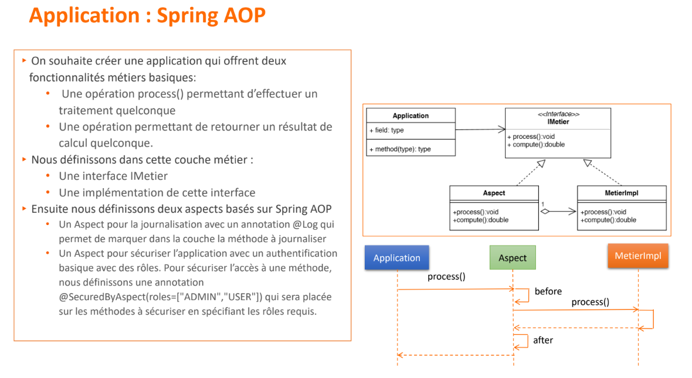
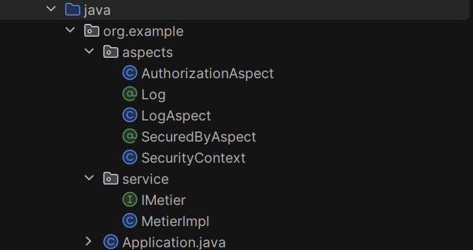
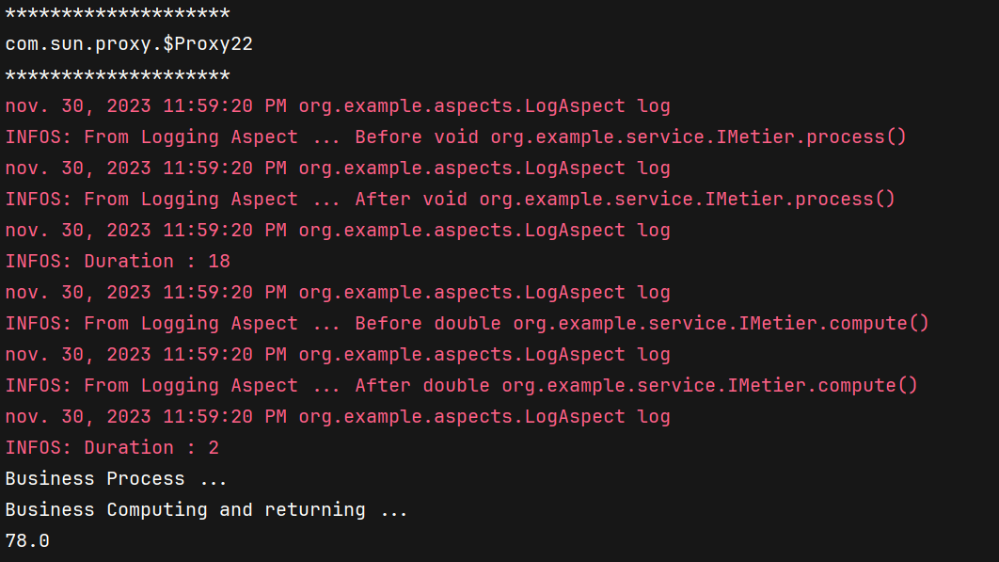
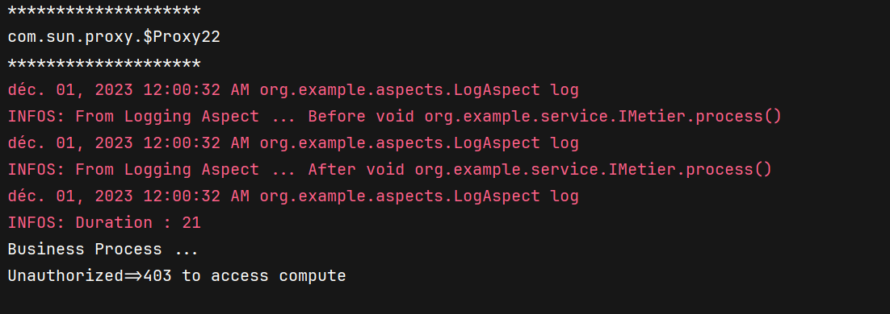

#  🔗  Activité Pratique AOP (Spring AOP)

# Partie II En utilsant Spring AOP



**Architecture**



> D'abord on ajoute les dépendances dans pom.xml

```xml
<dependencies>
        <dependency>
            <groupId>org.springframework</groupId>
            <artifactId>spring-core</artifactId>
            <version>5.2.5.RELEASE</version>
        </dependency>
        <dependency>
            <groupId>org.springframework</groupId>
            <artifactId>spring-context</artifactId>
            <version>5.2.5.RELEASE</version>
        </dependency>
        <dependency>
            <groupId>org.springframework</groupId>
            <artifactId>spring-beans</artifactId>
            <version>5.2.5.RELEASE</version>
        </dependency>
<dependency>
```

**Interface _IMetier_**

```java
public interface IMetier {
     void process();
     double compute();
}
```

**Implémentation _MetierImpl_**
> Cette classe MetierImpl est une implémentation de l'interface IMetier avec deux méthodes : process et compute. Elle utilise des annotations personnalisées telles que @Log et @SecuredByAspect pour appliquer des aspects spécifiques à ces méthodes.

```java
@Service
public class MetierImpl implements IMetier {
    @Override
    @Log
    @SecuredByAspect(roles={"USER","ADMIN"}) // both USER and ADMIN can access this method
    public void process() {
        System.out.println("Business Process ...");

    }

    @Override
    @Log
    @SecuredByAspect(roles={"ADMIN"}) // only ADMIN can access this method
    public double compute() {
        double x = 78;
        System.out.println("Business Computing and returning ...");
        return x;
    }
}
```

**Annotation _Log_**
> Cette annotation est utilisée pour marquer les méthodes qui doivent être loguées. Elle spécifie que l'annotation est disponible à l'exécution (@Retention(RetentionPolicy.RUNTIME)) et qu'elle peut être appliquée uniquement aux méthodes (@Target(ElementType.METHOD)).

```java
@Retention(RetentionPolicy.RUNTIME) // to be available at runtime (not only in the source code)
@Target(ElementType.METHOD) // to be used on methods only (not classes, fields, constructor, etc.)
public @interface Log {
}
```

**Aspect _LogAspect_**
> Cet aspect LogAspect utilise l'annotation @Log pour définir un pointcut qui correspond à toutes les méthodes annotées avec @Log. L'aspect utilise un conseil @Around pour loguer les informations avant et après l'exécution de la méthode, mesurer la durée d'exécution, et retourner le résultat.

```java
@Component
@Aspect
@EnableAspectJAutoProxy // To enable AspectJ Auto Proxy Support in Spring Framework (Spring AOP) we need to add @EnableAspectJAutoProxy annotation to our configuration class.
public class LogAspect {
    Logger logger = Logger.getLogger(LogAspect.class.getName());
 //   @Around("execution(* org.example.service.IMetier.*(..))")
    @Around("@annotation(Log)") // @annotation(Log) : This pointcut expression will match all the methods that are annotated with @Log annotation.
    public Object log(ProceedingJoinPoint proceedingJoinPoint) throws Throwable {
        long t1 = System.currentTimeMillis();
        logger.info("From Logging Aspect ... Before "+proceedingJoinPoint.getSignature());
        Object result = proceedingJoinPoint.proceed();
        logger.info("From Logging Aspect ... After "+proceedingJoinPoint.getSignature());
        long t2 = System.currentTimeMillis();
        logger.info("Duration : "+(t2-t1));
        return result;
    }
}
```

**Annotation _SecuredByAspect_**
> Cette annotation est utilisée pour marquer les méthodes qui nécessitent une sécurité basée sur des rôles. Elle spécifie les rôles autorisés pour accéder à la méthode.

```java
@Retention(RetentionPolicy.RUNTIME)
@Target(ElementType.METHOD)
public @interface SecuredByAspect {
    String[] roles();
}
```

**Aspect _SecurityContext_**
> La classe SecurityContext maintient des informations sur l'authentification et les rôles de l'utilisateur. La méthode authenticate est utilisée pour vérifier les informations d'identification, et la méthode hasRole est utilisée pour vérifier si l'utilisateur a un certain rôle.

```java
public class SecurityContext {
    private static String username="";
    private static String password="";
    private static String[] roles= {};
    public  static void authenticate(String username,String password,String[] roles){
        if(username.equals("root") && password.equals("1234")) {
            SecurityContext.username = username;
            SecurityContext.password = password;
            SecurityContext.roles = roles;
        }else {
            throw new RuntimeException("Access Denied");
        }
    }
    public static boolean hasRole(String role){
        for(String r:roles){
            if(r.equals(role)) return true;
        }
        return false;
    }
}
```

**Aspect _AuthorizationAspect_**
> Cet aspect AuthorizationAspect utilise l'annotation @SecuredByAspect pour définir un pointcut correspondant aux méthodes annotées. Il vérifie si l'utilisateur a les rôles nécessaires pour accéder à la méthode. Si l'utilisateur est autorisé, l'exécution de la méthode se poursuit, sinon une exception RuntimeException est levée.

```java
@Component
@Aspect
@EnableAspectJAutoProxy
public class AuthorizationAspect {
    @Around(value = "@annotation(securedByAspect)",argNames = "proceedingJoinPoint,securedByAspect")
    public Object secure(ProceedingJoinPoint proceedingJoinPoint, SecuredByAspect securedByAspect) throws Throwable {
        String[] roles = securedByAspect.roles();
        boolean isAuthorized = false;
        for (String role : roles) {
            if (SecurityContext.hasRole(role)) {
                isAuthorized = true;
                break;
            }
        }
        if (isAuthorized) {
            return proceedingJoinPoint.proceed();
        }
            throw new RuntimeException("Unauthorized=>403 to access "+proceedingJoinPoint.getSignature().getName());

    }
    /*@AfterThrowing()
    public void logException(Exception e){

    }*/
}
```

**Application _main_**
> La classe Application représente le point d'entrée de l'application. Elle effectue une authentification via SecurityContext, crée le contexte Spring (ApplicationContext) en utilisant une configuration (MyConfig), obtient une instance de IMetier à partir du contexte, puis appelle les méthodes process et compute. Les résultats sont affichés sur la console. La configuration MyConfig utilise l'annotation @ComponentScan pour scanner les classes dans le package org.example.

```java
public class Application {
    public static void main(String[] args) {
        try {
            SecurityContext.authenticate("root","1234",new String[]{"USER","ADMIN"});
            ApplicationContext applicationContext=new AnnotationConfigApplicationContext(MyConfig.class);
            IMetier metier=applicationContext.getBean(IMetier.class);
            System.out.println("********************");
            System.out.println(metier.getClass().getName());
            System.out.println("********************");
            metier.process();
            System.out.println(metier.compute());
        }catch (Exception e){
            System.out.println(e.getMessage());
        }
    }
}
@Configuration
@ComponentScan("org.example")
class MyConfig{
}
```
**Exécution**



> L'application a affiché des informations de logging avant et après l'exécution de la méthode process en utilisant l'aspect LogAspect. Cependant, l'accès à la méthode compute a été refusé en raison d'une autorisation insuffisante, comme le montre le message "Unauthorized=>403 to access compute".

